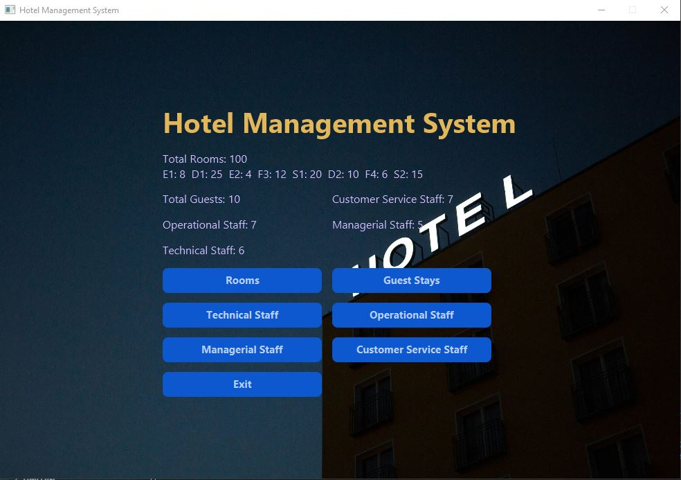
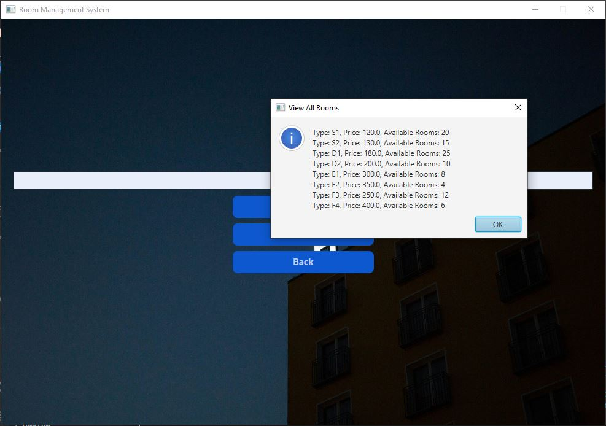
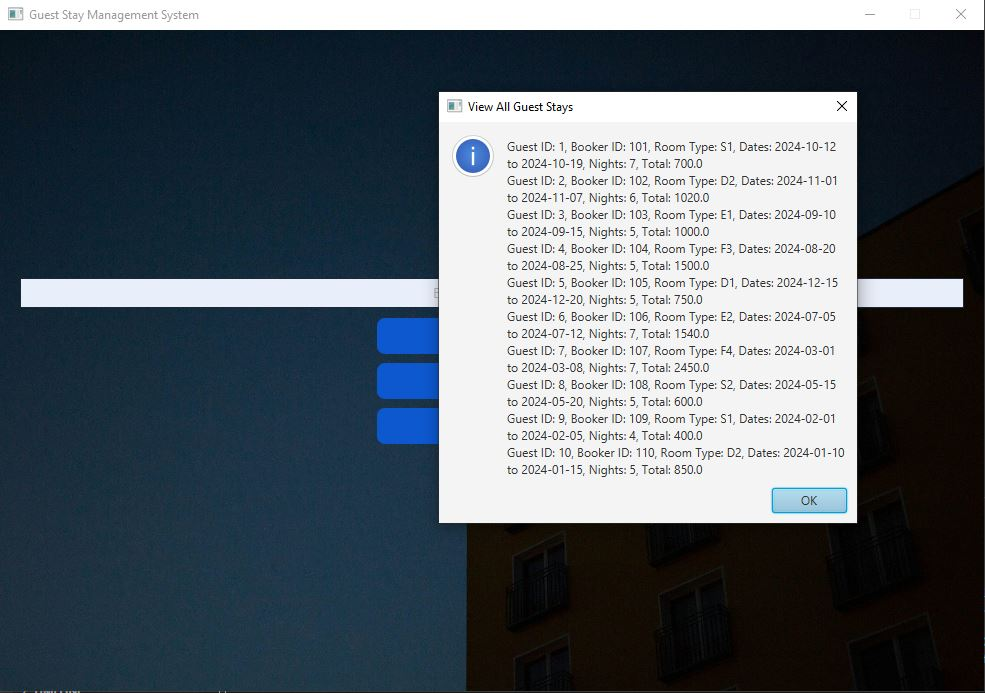
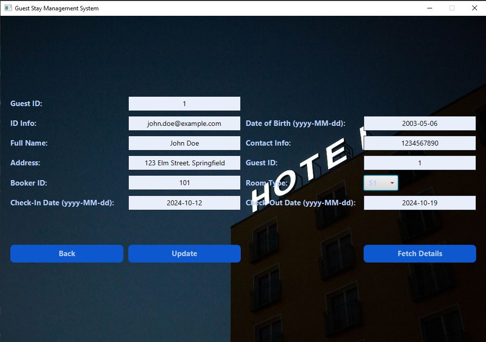
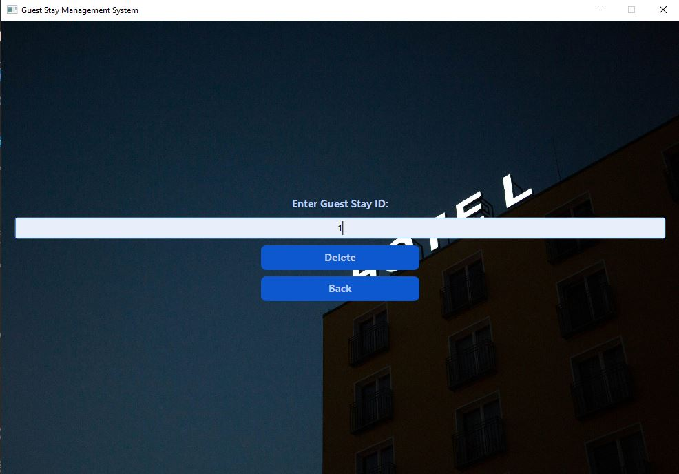
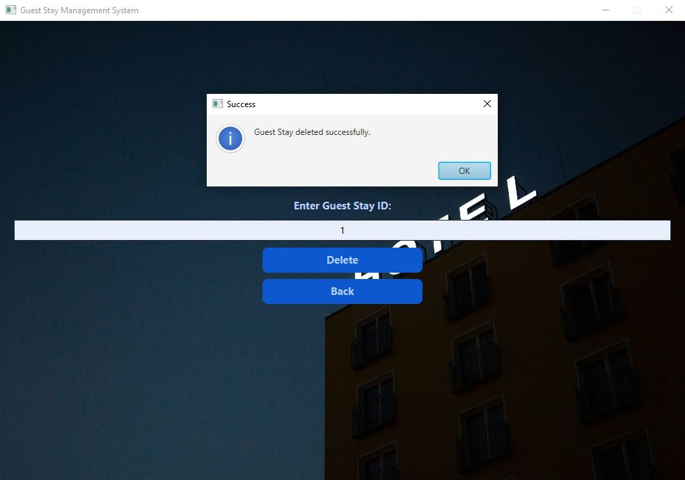
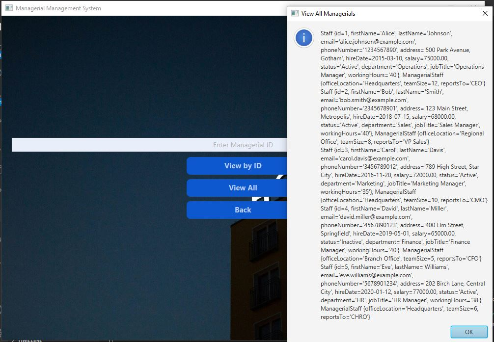
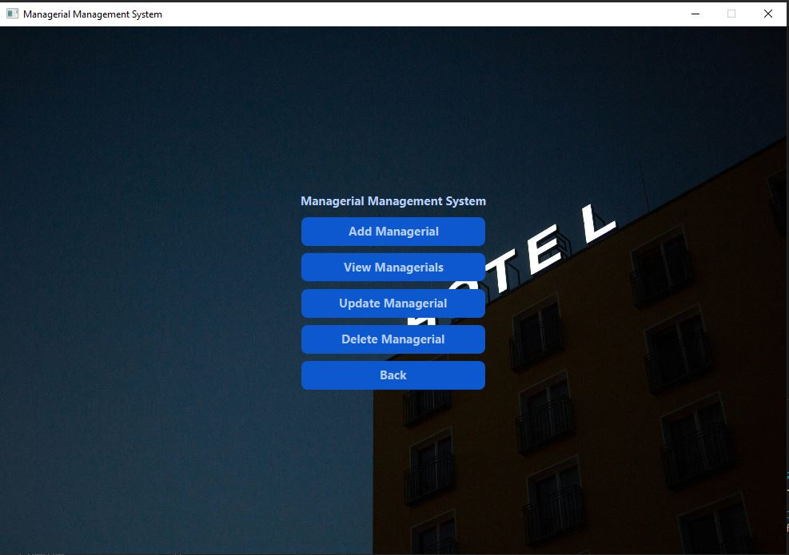
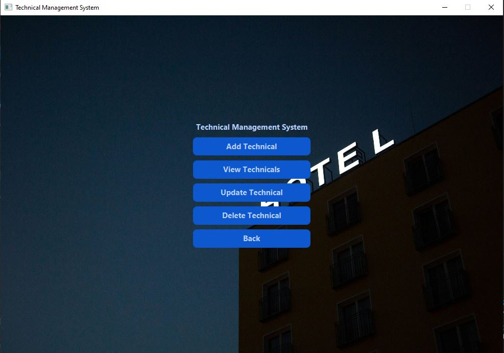
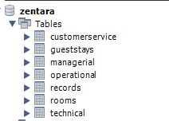

# Setup Guide for Cloning the Project

## Prerequisites

Before cloning the project, ensure that you have the following installed on your machine:

### Java Development Kit (JDK)

- Ensure you have **JDK 11** or later installed. If not, download and install it from the [Oracle website](https://www.oracle.com/java/technologies/javase-downloads.html).

### JavaFX SDK

- Download the [JavaFX SDK](https://gluonhq.com/products/javafx/) and extract it to a location on your machine (e.g., `C:/javafx-sdk-23.0.1/`).

### MySQL Connector/J (JDBC)

- Download the [MySQL Connector/J](https://dev.mysql.com/downloads/connector/j/) (JDBC driver). Place it in a directory like `C:/mysql-connector-j-9.1.0/`.

### MySQL Database

- Ensure you have a MySQL instance running and properly configured for your project. Adjust the connection settings in the project to match your local database configuration.

## Cloning the Project

Clone the repository using the following command:

```bash
git clone https://github.com/MedYessinKhlif/HotelManagement.git
cd HotelManagement
```

## Setting up the Project in VS Code

1. Open the cloned project in **Visual Studio Code**.
2. You should see the `.vscode` folder containing `launch.json` and `settings.json`.

### JavaFX and MySQL Setup

#### Set up `launch.json`

The `launch.json` file configures how the JavaFX application is launched. Ensure the path to the JavaFX SDK is correct. Update the following if necessary:

```json
"vmArgs": "--module-path \"C:/javafx-sdk-23.0.1/lib\" --add-modules javafx.controls,javafx.fxml"
```

Ensure the path points to the location of your JavaFX SDK.

#### Set up `settings.json`

The `settings.json` file configures source paths, output paths, and referenced libraries for the Java project. Modify it as follows:

```json
"java.project.referencedLibraries": [
    "lib/**/*.jar",  
    "C:/javafx-sdk-23.0.1/lib/*.jar"
]
```

Again, adjust the path to the JavaFX SDK if it's located elsewhere on your system.

#### Set up MySQL Connector

Ensure that the MySQL Connector/J (e.g., `mysql-connector-j-9.1.0.jar`) is included in your project as specified in `launch.json` and `settings.json`.

## Building and Running the Project

### Compile the Project

You can compile the project using the following command:

```bash
javac -cp ".;C:/mysql-connector-j-9.1.0/mysql-connector-j-9.1.0.jar;C:/javafx-sdk-23.0.1/lib/*" --module-path "C:/javafx-sdk-23.0.1/lib" --add-modules javafx.controls,javafx.fxml Main/MainInterface.java
```

Ensure the paths for the JavaFX SDK and MySQL Connector/J are correct for your system.

### Run the Project

To run the project, use the following command:

```bash
java -cp ".;C:/mysql-connector-j-9.1.0/mysql-connector-j-9.1.0.jar;C:/javafx-sdk-23.0.1/lib/*" --module-path "C:/javafx-sdk-23.0.1/lib" --add-modules javafx.controls,javafx.fxml Main.MainInterface
```

This will launch the `MainInterface` JavaFX application.


## Setting up the Database
After cloning the project, you need to create the SQL tables based on the attributes and table names in the DAL (Data Access Layer) files. The DAL files define the structure and relationships of the database tables.


## Troubleshooting

- **Path Issues:** If you encounter problems with paths or dependencies, ensure the paths to JavaFX and MySQL Connector in the `launch.json` and `settings.json` files are correct.
- **Database Connectivity Issues:** Double-check your MySQL connection settings (username, password, database URL) and ensure your MySQL instance is running.

## Additional Notes

- The `.vscode` files (`launch.json` and `settings.json`) have been manually set up to simplify the configuration for JavaFX development and handle MySQL database connections.
- If you encounter any other issues, feel free to raise an issue on the [GitHub repository](https://github.com/MedYessinKhlif/HotelManagement.git).
easier for JavaFX development and to handle MySQL database connections.

## Application Functionalities

The Hotel Management Java desktop application offers efficient management of various hotel operations. The key features include:

- **Staff Management:** Manage various staff categories, including managerial, customer service, technical, and operational. Each category supports full CRUD operations (Create, Read, Update, Delete). The Staff class, providing general staff information, is extended by Managerial, CustomerService, Technical, and Operational classes to represent specific staff categories with additional attributes and behaviors.

- **Room Management:** Handle room details, availability status, and assignments.
The application supports various room types, defined within the `RoomType` enumeration:

| Room Type | Description                       |
|-----------|-----------------------------------|
| S1, S2    | Standard room for 1 or 2 people   |
| D1, D2    | Deluxe room for 1 or 2 people     |
| E1, E2    | Exclusive room for 1 or 2 people  |
| F3, F4    | Family room for 3 or 4 people     |

- **Booking Management:** Manage guest stays, booking details, and real-time availability checks.

The application uses JavaFX for the admin interface and MySQL Workbench for robust database integration. Each class, such as Rooms, GuestStays, Technical, Operational, CustomerService, and Management, has an interface and a data access layer (DAL) file that communicates with the MySQL database through SQL queries.


### Screenshots and Interface

Below are placeholders for screenshots depicting various functionalities of the application. You can add the source of each image manually.

|  |  |  |  |
|---------------------------------------------|---------------------------------------------|---------------------------------------------|---------------------------------------------|
|  |  |  |  |
|  |  |  |  |
